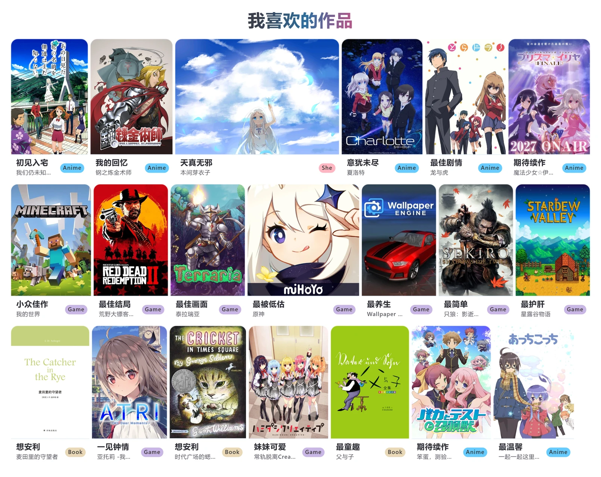
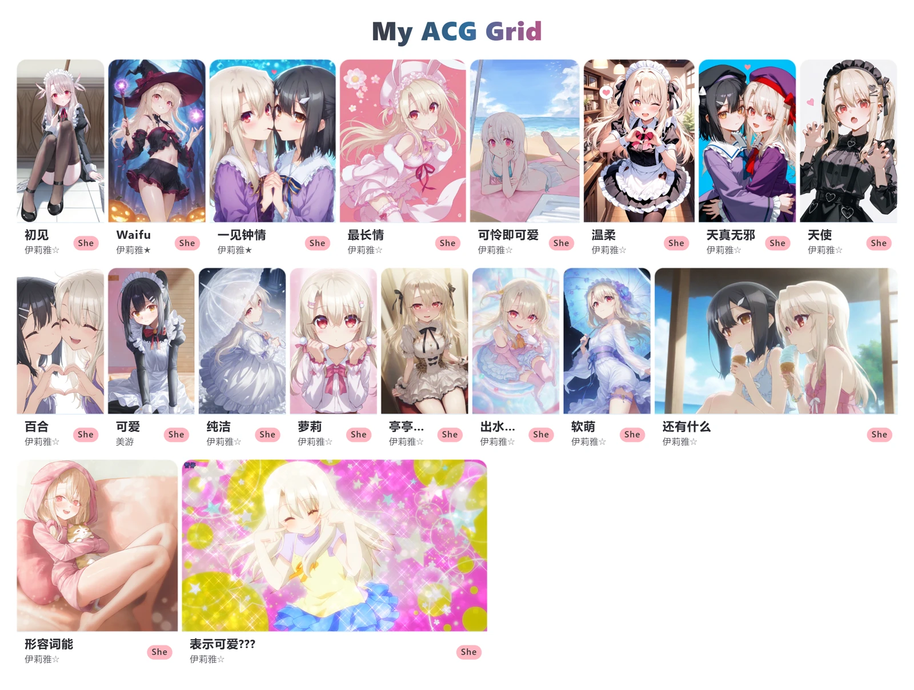

# My ACG Grid

一个把你喜欢的动漫、游戏、书籍，作品和角色，总结成一面卡片墙的网页，可以一键导出高清 PNG，分享给朋友。

**👉 在线体验：[grid.1dream.online](https://grid.1dream.online)**

bangumi API 搜不到的，或者你有更美观的图片，也可以本地上传。

作品卡片墙示例：

角色卡片墙示例——当然你也可以这样，如果你喜欢的话 `>_<`：

## 功能
- **数据只属于你**：所有数据保存在你自己的浏览器里，不上传任何服务器；（尽管有持久化存储，但还是建议尽快导出，避免缓存丢失）

## 技术栈

React 19 + TypeScript + Vite + pnpm + Dexie，数据存储于浏览器本地（IndexedDB），部署在 Cloudflare。

## 许可证

[MIT](LICENSE)
